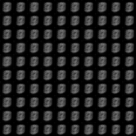

# MnistRecognition
MNIST handwritten digit recognition system (Artificial Intelligence final project)

## Supervised Learning

|model|Accuracy|
|:---:|:---:|
|two layer full connected network|97.546|
|two layer cnn and a full connected layer|99.219|

Use two layer full connected network to study accuracy in different training samples

You can see that 81% is achieved with only 250 samples and 90% with 2000. You need 27x the data to go from 90% to 97.5% with the simple network.

## Semi-Supervised Learning

What about a world where you only have **2000 labeled samples** but **have another 53000 unlabeled samples**?
Can we somehow learn something in an unsupervised way from all 55000 digits that might help us to better than our 90% baseline?
This is the goal of semi-supervised learning.

### AutoEncoder
First we learn an AutoEncoder,that encoder the input image to a embedding and then
decode the embedding to reconstruct the image.

The following gif is the AutoEncoder learning process,reconstruct image at different stages of learning:

we can also directly randomly generate embedding vector and  construct image

Below is a scatter plot of the 10,000 training samples from MNIST embedded in a 2-D space.

### Help Supervised Learning

We send the embedding(learned from autoencoder) of the image into a fully connected neural network.

|model|Accuracy|
|:---:|:---:|
|2000 labeled samples,supervised|88.030|
|2000 labeled samples,53000 unlabeled samples,semi-supervised|92.176|

Reference:
- [Auto-Encoding Variational Bayes](https://arxiv.org/pdf/1312.6114.pdf)

## Reinforcement Learning
Neural Architecture Search (NAS) with Reinforcement Learning is a method for finding good neural networks architecture.
For this part, we will try to find optimal architecture for Convolutional Neural Network (CNN) which recognizes handwritten digits.

For a signal layer network,we search the hidden layer size from 10 to 800 and step is 20.

The result is the following:

|HiddenSize|Accuracy|Reward|totalReward|
|:---:|:---:|:---:|:---:|
160|0.9781|0.1|0.1
450|0.9816|0.0035|0.1035
40|0.9687|-0.0101|0.0934
90|0.9765|-0.00028|0.09312
220|0.9797|0.00298|0.0961
30|0.9631|-0.01422|0.08188
580|0.9817|0.00722|0.0891
470|0.982|0.00608|0.09518
410|0.9813|0.00416|0.09934
160|0.9779|-7e-05|0.09928
**710**|**0.983**|**0.00504**|0.10432
420|0.9813|0.00234|0.10666
50|0.9689|-0.01053|0.09613
610|0.9821|0.00477|0.1009
160|0.9798|0.00152|0.10242
280|0.9805|0.00192|0.10434
140|0.9795|0.00053|0.10487
740|0.9837|0.00463|0.1095
380|0.9814|0.0014|0.1109
360|0.9816|0.00132|0.11222
530|0.9831|0.00256|**0.11477**
160|0.9804|-0.00065|0.11412
100|0.9769|-0.00402|0.1101
660|0.9829|0.00278|0.11288
600|0.9824|0.00172|0.1146
60|0.9747|-0.00632|0.10828
230|0.9798|4e-05|0.10832
190|0.9809|0.00114|0.10946

For a signal layer network,we search the two layers cnn parameters.

The result is the following:

|CNN_1_kernel|CNN_1_kernel|CNN_2_kernel|CNN_2_kernel|Accuracy|Reward|totalReward|
|:---:|:---:|:---:|:---:|:---:|:---:|:---:|
**5**|**16**|**4**|**32**|**0.9924**|0.1|0.1
4|16|4|32|0.9916|-0.0008|0.0992

Overview

|Model|Accuracy|
|:---:|:---|
|Supervised learning fc|97.546|
|Using RL,Supervised learning fc|98.300|
|Supervised learning cnn fc|99.219|
|Using RL,Supervised learning cnn fc|99.240|

Reference:
- [Neural Architecture Search with Reinforcement Learning](https://arxiv.org/pdf/1611.01578.pdf)
- [neural-architecture-search](https://github.com/titu1994/neural-architecture-search)

## Evolutionary Computation

Reference:
- [EDEN: Evolutionary Deep Networks for Efficient
Machine Learning](https://arxiv.org/pdf/1709.09161.pdf)
- [MNIST_Evolutionary_Algorithm](https://github.com/asbran/MNIST_Evolutionary_Algorithm)
- [Picture_Evolution](https://github.com/ncblair/Picture_Evolution)